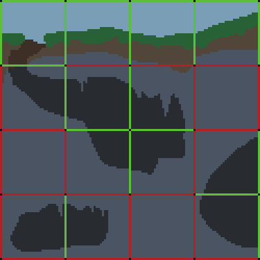
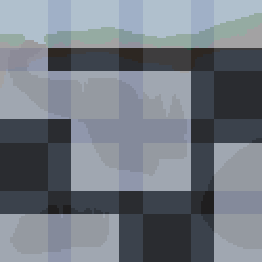

# Luxana
A library to aid in the creation of multiplayer voxel games with persistent simulated worlds. These worlds are referred to as universes.

Example games that the library should (ideally) aid in the creation of:
- Minecraft (non-infinite worlds)
- Dwarf Fortress
- Rust
- Escape from Tarkov
- Avorion
- Star Sector
- Starbase

## Target
- 0: Networking, First Person, Third Person, RTS, Voxels
- 1: Large scale entity interactions (battles)
- 1: Large scale persistent simulation (economy, conflict)
- 1: Proximity based system pool LOD
- 2: Local fidelity at scale of player character (human sized)
- 3: Hybrid voxel mesh building system
- 4: Structures/Vehicles made of networks of components
    - Components create a cached state which is only updated when a component is changed
- 5: IK Locomotion

???
- 6: LoD voxel pathfinding
- 7: Material based Voxel -> Voronoi blending
- 8: Per system benchmarking and automatic performance tuning (rising performance + function timings + performance metric(s))
- 9: Sector streaming

## Features
- Universes
    - Characters
    - Voxel physics vehicles
    - Loose physics objects
- Non-deterministic

## Todo
- Profiler

# Notes
In order to simulate entire galaxies of content, without ever completely unloading/freezing parts of the world, extreme and aggressive LOD is applied to simulated data, resulting in the non-deterministic qualities of the library.
- Characters will be reduced to clumps of similar characters
- Galaxy spanning factions may be simplified into zones with actions & personality determined by the more detailed data. This data is present when the world is loaded or when the player is nearby; after it is used to generate the simplified model (due to no nearby players), the detailed data is unloaded. When a player begins to approach a simplified model, the game will load the detailed data, compare it against the current state of the simplified model, calculate a new detailed state, and then begin to phase in the detailed state to replace the simplified state.
- Objects which the player has directly interacted with will receive special tags to keep any changes in their state from being too preposterous, as the process of translating data repeatedly from simplified to detailed can have distortive effects.

## Player, Window, Camera
- ECS will loop through each Window by where they are in memory, not order
- ID Component on windows can allow rendering them in the correct position regardless of storage order
- Windows as loose entities will not allow performantly targeting a specific window by index
- It does allow targeting a window by Entity, however
- It also requires less overhead (manager resource) when interacting with windows
- As far as game data is concerned, we only know windows by their Entity ID, not their number
- Closing the last window would require looping through all windows to find the largest ID

### Input Model
- One input receiver (camera, character, menu) could be open to input from multiple players or a single player

## Menus
- Any hotkeys will also need to show up in the bindings menu
- May be a 3D Object
- May be locked to camera view
- May need to be unloaded (Main Menu while in-game)
- May be a static display (Main Menu) or a dynamic display (Inventory window which may be dragged & resized)
- `Main Menu` would consist of multiple Menu entities, one for each unconnected area (Intro, Main, Settings)

## On Distortion
Consider the following scenario:
1. A living entity is trapped in a way in which it could not possibly escape
2. When the player is gone:
    - Detailed state is saved
    - Detailed state is used in the generation of a simplified model representing each entity of that type in the region
    - The entity is removed
3. When the player returns:
    - A bitmask representing the voxel positions which have saved detailed states which need to be turned back into runtime entities is checked
    - The population count in the simplified model may have changed; the position of the model may have changed; the current state of the simplified model effectively represents the range of possible outcomes for a given entity
    - The game compares the saved detailed state, the current state of the area around the position the entity was saved at, and the state of the simplified model. This provides probabilities for different outcomes, and rng is used to decide whether the outcomes are true or not.
    - In the case of the entity in a cage, assuming that the cage had not been altered by other simulations, the game would find that the current state results in movement (outside a certain range) being impossible, and therefore not a possible outcome. No matter where the simplified model had moved the runtime entity would still be valid for this location.

This scenario works out assuming that the cage is relatively small. However, problems begin to arise as the cage grows in size. Floodfill is only viable for small volumes.

To keep living entities from mysteriously escaping large entrapped areas while the player is gone, a bitmask will be used to track valid pathing connections between chunks:

This connection bitmask can be reduced to a simplified grid of passable and unpassable tiles:

## Misc
- Simple collision meshes around [things]
- Slider to determine how detailed the simulation should be (how much processing power should be used to avoid distortions)

Ships, with stats, colliders, event points (thrust, projectile). Represented by voxels.

Characters, represented by body parts connected by joints.
Or,
Characters, the same as ships but at a smaller scale. Represented by voxels.

A data structure which represents the world. A world which contains: Ships (physics), characters (physics), objects (physics), and celestial bodies (mostly fake physics, occasionally real).

The world must seamlessly come in and out of existence at varying levels of detail. The entire world must always be loaded, at some level of detail, for simulation purposes. Individual actors will have their details serialized (out of runtime memory) and then be simplified into conglomerations of like actors. An entire planet, when the player is far away, will be reduced as close as possible to a single entity. Great enough distance, an entire solar system.

Things don't need to make sense. They just need to follow a strict set of rules which is communicated by the design of the game. And those rules will be determined by the architecture of the computer and the software that runs on it.

The data has to morph too to keep memory usage light. The representation needs to morph alongside the data, preferably as uncaring to the particular transformations as possible.

A ship, represented visually by polygons, created by meshing the voxel data associated with the ship. The ship stored as an entity with a mesh component, a voxel component, components for the stats of the ship. Data and View components can both be applied to the same entity without issue.

## Gui
- A hitbox that reports hit events with cursors
- GuiButtonState
    - Changes to the button are recorded in this component
- GuiButtonFunction
    - Reads GuiButtonState, not concerned with how the button reaches the triggering state
    - Trigger to respond to
    - Id to send in ButtonFunctionEvent, which can then be responded to by the game using the button

## Data (Asset)
- Break data up so that we only need to load what we're going to use:
    - DisplayData: Bare minimum for displaying the Data, like names and icons for a Profile, etc.
    - 